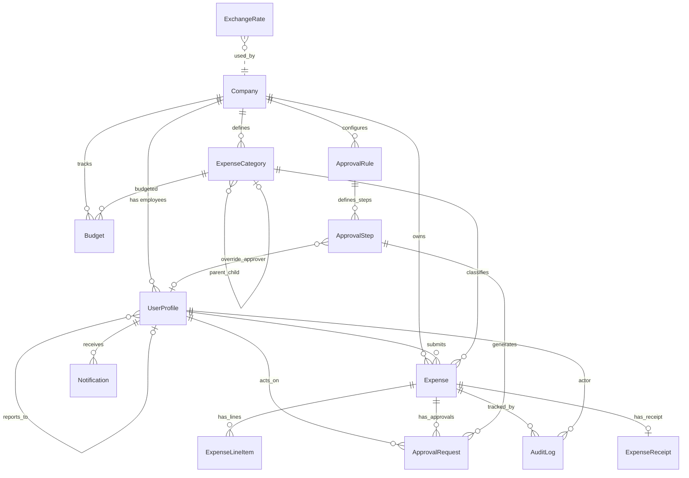

# FlowExpense — Enhanced Database Design

## Design Principles

| Principle | Decision |
|:---|:---|
| **Primary Keys** | UUID everywhere — prevents enumeration, safe for distributed |
| **Soft Deletes** | `is_deleted` + `deleted_at` on financial tables — never lose data |
| **Audit Trail** | Separate immutable `AuditLog` — append-only, no update/delete |
| **Multi-tenancy** | Every table scoped via `company` FK — row-level isolation |
| **Normalization** | 3NF minimum — no repeated groups |
| **Monetary** | `DecimalField(max_digits=15, decimal_places=4)` — never FLOAT |
| **Timestamps** | UTC always, `auto_now_add` / `auto_now` |
| **JSON fields** | Only for truly dynamic data (policy_violations, ocr_metadata) |

---

## ER Diagram



---

## Table 1: `Company`

| Column | Type | Constraints | Notes |
|:---|:---|:---|:---|
| `id` | UUID | PK, default uuid4 | |
| `name` | VARCHAR(255) | NOT NULL | Legal company name |
| `slug` | SlugField(100) | UNIQUE, NOT NULL | URL-safe identifier, auto-generated |
| `country` | VARCHAR(100) | NOT NULL | From restcountries API |
| `default_currency` | VARCHAR(10) | NOT NULL | ISO 4217 code (INR, USD, EUR) |
| `currency_symbol` | VARCHAR(5) | NOT NULL | ₹, $, €, £ |
| `fiscal_year_start` | SmallInt | DEFAULT 4 | Month number (1=Jan, 4=Apr for India) |
| `logo` | ImageField | NULL | Company logo upload |
| `max_expense_amount` | Decimal(15,4) | NULL | Global per-claim ceiling |
| `require_receipt_above` | Decimal(15,4) | DEFAULT 500 | Receipt mandatory above this |
| `is_active` | Boolean | DEFAULT TRUE | |
| `created_at` | DateTimeTZ | auto_now_add | |
| `updated_at` | DateTimeTZ | auto_now | |

**Indexes**: `(slug)` UNIQUE, `(is_active)`

> [!NOTE]
> Company-level policies (max_expense_amount, require_receipt_above) act as global guardrails. Category-level limits override these when set.

---

## Table 2: `UserProfile`

| Column | Type | Constraints | Notes |
|:---|:---|:---|:---|
| `id` | UUID | PK | |
| `user` | FK(auth_user) | ONE-TO-ONE, CASCADE | Django built-in user (email, password) |
| `company` | FK(Company) | CASCADE | Tenant scoping |
| `role` | VARCHAR(20) | CHECK: admin/manager/employee | Drives all permissions |
| `manager` | FK(self) | NULL, SET_NULL | Self-referential for reporting chain |
| `employee_id` | VARCHAR(50) | NULL | Optional HR/payroll identifier |
| `department` | VARCHAR(100) | NULL | E.g., Finance, Engineering, HR |
| `designation` | VARCHAR(100) | NULL | Job title: CFO, Director, Team Lead |
| `is_manager_approver` | Boolean | DEFAULT FALSE | Employee's manager auto-approves first |
| `phone` | VARCHAR(20) | NULL | Contact number |
| `avatar` | ImageField | NULL | Profile picture |
| `daily_expense_limit` | Decimal(15,4) | NULL | Per-user daily ceiling |
| `monthly_expense_limit` | Decimal(15,4) | NULL | Per-user monthly ceiling |
| `is_active` | Boolean | DEFAULT TRUE | |
| `is_deleted` | Boolean | DEFAULT FALSE | Soft delete |
| `deleted_at` | DateTimeTZ | NULL | |
| `created_at` | DateTimeTZ | auto_now_add | |
| `updated_at` | DateTimeTZ | auto_now | |

**Indexes**: `(company, role)`, `(company, is_active)`, `(manager)`, `(company, department)`

---

## Table 3: `ExpenseCategory` ⭐ (Enhanced)

| Column | Type | Constraints | Notes |
|:---|:---|:---|:---|
| `id` | UUID | PK | |
| `company` | FK(Company) | CASCADE | Tenant-scoped categories |
| `parent` | FK(self) | NULL, SET_NULL | **Hierarchical**: Travel → Airfare, Hotel, Meals |
| `name` | VARCHAR(100) | NOT NULL | E.g., Travel, Meals, Office Supplies |
| `code` | VARCHAR(20) | NULL | Short code: TRV, MEL, OFS |
| `description` | TEXT | NULL | What this category covers |
| `gl_code` | VARCHAR(50) | NULL | General Ledger code for accounting/ERP |
| `cost_center` | VARCHAR(50) | NULL | Cost center code for departmental accounting |
| `icon` | VARCHAR(50) | DEFAULT '📋' | Emoji or icon class for UI display |
| `color` | VARCHAR(7) | DEFAULT '#6366f1' | Hex color for UI badges/charts |
| `daily_limit` | Decimal(15,4) | NULL | Max per day in company currency |
| `single_expense_limit` | Decimal(15,4) | NULL | Max per single claim |
| `monthly_limit` | Decimal(15,4) | NULL | Max per month per employee |
| `requires_receipt_above` | Decimal(15,4) | NULL | Receipt mandatory above this (overrides company) |
| `tax_rate` | Decimal(5,2) | DEFAULT 0 | Applicable tax rate (GST/VAT %) |
| `is_taxable` | Boolean | DEFAULT FALSE | Whether expenses here are taxable |
| `requires_description` | Boolean | DEFAULT TRUE | Force description on submission |
| `requires_merchant` | Boolean | DEFAULT FALSE | Force merchant name on submission |
| `allowed_roles` | JSONField | DEFAULT '[]' | Empty = all roles; ["employee","manager"] = restricted |
| `sort_order` | SmallInt | DEFAULT 0 | Display ordering in dropdowns/lists |
| `is_active` | Boolean | DEFAULT TRUE | Deactivated categories hidden from new expenses |
| `created_at` | DateTimeTZ | auto_now_add | |
| `updated_at` | DateTimeTZ | auto_now | |

**Indexes**: `(company, is_active)`, `(company, parent)`, `(company, gl_code)`
**Unique**: `(company, name, parent)` — same name can exist under different parents

> [!IMPORTANT]
> **Parent-Child Hierarchy** enables sub-categories:
> ```
> Travel (parent=NULL)
>   ├── Airfare (parent=Travel)
>   ├── Hotel (parent=Travel)
>   ├── Ground Transport (parent=Travel)
>   └── Per Diem (parent=Travel)
> Meals (parent=NULL)
>   ├── Client Entertainment (parent=Meals)
>   └── Team Lunch (parent=Meals)
> Office Supplies (parent=NULL)
> Software & Subscriptions (parent=NULL)
> ```

> [!TIP]
> **Spending Limits Cascade**: If a category has no limit set, the system falls back to the company-level limit. This allows fine-grained control per category while keeping defaults simple.

---

## Table 4: `Expense`

| Column | Type | Constraints | Notes |
|:---|:---|:---|:---|
| `id` | UUID | PK | |
| `company` | FK(Company) | CASCADE | Denormalized for fast queries |
| `employee` | FK(UserProfile) | CASCADE | Submitter |
| `category` | FK(ExpenseCategory) | PROTECT | Can't delete category with expenses |
| `title` | VARCHAR(255) | NOT NULL | Short label |
| `description` | TEXT | NULL | Detailed notes |
| `expense_date` | DateField | NOT NULL | When expense occurred |
| `amount` | Decimal(15,4) | NOT NULL, CHECK > 0 | Original amount in submission currency |
| `currency` | VARCHAR(10) | NOT NULL | Submission currency (e.g., USD) |
| `exchange_rate` | Decimal(15,6) | NOT NULL, DEFAULT 1.0 | Locked at submission time |
| `converted_amount` | Decimal(15,4) | NOT NULL | In company's default currency |
| `merchant_name` | VARCHAR(255) | NULL | Vendor/restaurant name |
| `merchant_location` | VARCHAR(255) | NULL | City/address |
| `payment_method` | VARCHAR(50) | DEFAULT 'personal' | personal/corporate_card/cash |
| `status` | VARCHAR(30) | DEFAULT 'draft' | State machine (see below) |
| `submitted_at` | DateTimeTZ | NULL | When formally submitted |
| `approved_at` | DateTimeTZ | NULL | Final approval timestamp |
| `rejected_at` | DateTimeTZ | NULL | Rejection timestamp |
| `rejection_reason` | TEXT | NULL | Last rejection comment |
| `current_step` | SmallInt | DEFAULT 0 | Current approval step index |
| `is_flagged_duplicate` | Boolean | DEFAULT FALSE | Auto-detected duplicate |
| `policy_violations` | JSONField | DEFAULT '[]' | List of violation strings |
| `ocr_metadata` | JSONField | DEFAULT '{}' | Raw OCR extraction data |
| `notes` | TEXT | NULL | Internal admin notes |
| `is_deleted` | Boolean | DEFAULT FALSE | |
| `deleted_at` | DateTimeTZ | NULL | |
| `created_at` | DateTimeTZ | auto_now_add | |
| `updated_at` | DateTimeTZ | auto_now | |

**Status State Machine**: `draft` → `submitted` → `pending_approval` → `approved` / `rejected` / `recalled`

**Indexes**: `(company, status)`, `(employee, status)`, `(expense_date)`, `(company, expense_date)`, `(category, expense_date)`, `(is_flagged_duplicate)`

---

## Table 5: `ExpenseLineItem` (NEW — Multi-line Expenses)

| Column | Type | Constraints | Notes |
|:---|:---|:---|:---|
| `id` | UUID | PK | |
| `expense` | FK(Expense) | CASCADE | Parent expense |
| `description` | VARCHAR(255) | NOT NULL | What this line item is for |
| `amount` | Decimal(15,4) | NOT NULL, CHECK > 0 | Line amount in expense currency |
| `category` | FK(ExpenseCategory) | PROTECT | Can differ from parent for split expenses |
| `tax_amount` | Decimal(15,4) | DEFAULT 0 | Calculated tax |
| `sort_order` | SmallInt | DEFAULT 0 | Display order |
| `created_at` | DateTimeTZ | auto_now_add | |

**Indexes**: `(expense)`

> [!NOTE]
> Expense line items allow a single expense to be split across multiple categories (e.g., a hotel bill with room + meals + parking). The parent `Expense.amount` is the sum of all line items.

---

## Table 6: `ExpenseReceipt`

| Column | Type | Constraints | Notes |
|:---|:---|:---|:---|
| `id` | UUID | PK | |
| `expense` | FK(Expense) | CASCADE, UNIQUE | One receipt per expense |
| `file` | FileField | NOT NULL | Upload path: receipts/{company_id}/{year}/{filename} |
| `file_name` | VARCHAR(255) | NOT NULL | Original filename |
| `file_size` | IntegerField | NULL | Bytes |
| `mime_type` | VARCHAR(100) | NULL | image/jpeg, image/png, application/pdf |
| `ocr_raw_text` | TextField | NULL | Full OCR extracted text |
| `ocr_confidence` | Decimal(5,2) | NULL | OCR confidence score (0-100%) |
| `ocr_processed_at` | DateTimeTZ | NULL | |
| `uploaded_at` | DateTimeTZ | auto_now_add | |

---

## Table 7: `ApprovalRule`

| Column | Type | Constraints | Notes |
|:---|:---|:---|:---|
| `id` | UUID | PK | |
| `company` | FK(Company) | CASCADE | |
| `name` | VARCHAR(255) | NOT NULL | E.g., "High Value Expense Rule" |
| `description` | TEXT | NULL | |
| `min_amount` | Decimal(15,4) | NULL | Applies if amount ≥ this |
| `max_amount` | Decimal(15,4) | NULL | Applies if amount ≤ this (NULL = no cap) |
| `category` | FK(ExpenseCategory) | NULL, SET_NULL | NULL = all categories |
| `department` | VARCHAR(100) | NULL | NULL = all departments |
| `priority` | SmallInt | DEFAULT 0 | Higher = matched first |
| `is_active` | Boolean | DEFAULT TRUE | |
| `created_at` | DateTimeTZ | auto_now_add | |
| `updated_at` | DateTimeTZ | auto_now | |

**Indexes**: `(company, is_active, priority DESC)`, `(company, category)`
**Logic**: Find highest-priority active rule where `min ≤ converted_amount ≤ max`

---

## Table 8: `ApprovalStep`

| Column | Type | Constraints | Notes |
|:---|:---|:---|:---|
| `id` | UUID | PK | |
| `rule` | FK(ApprovalRule) | CASCADE | |
| `step_order` | SmallInt | NOT NULL | 1, 2, 3... |
| `step_name` | VARCHAR(100) | NULL | "Manager Review", "Finance Gate" |
| `approver_type` | VARCHAR(20) | CHECK: user/role/manager | How approver is resolved |
| `approver_user` | FK(UserProfile) | NULL | When type='user' |
| `approver_role` | VARCHAR(20) | NULL | 'manager','admin','finance' |
| `is_manager_approver` | Boolean | DEFAULT FALSE | Routes to submitter's direct manager |
| `percentage_required` | SmallInt | DEFAULT 100, CHECK 1-100 | Quorum% needed |
| `override_approver` | FK(UserProfile) | NULL | CFO override — auto-approve if they say yes |
| `auto_approve_days` | SmallInt | NULL | Auto-approve if no action in N days |
| `created_at` | DateTimeTZ | auto_now_add | |

**Unique**: `(rule, step_order)`

---

## Table 9: `ApprovalRequest`

| Column | Type | Constraints | Notes |
|:---|:---|:---|:---|
| `id` | UUID | PK | |
| `expense` | FK(Expense) | CASCADE | |
| `step` | FK(ApprovalStep) | CASCADE | |
| `assigned_to` | FK(UserProfile) | CASCADE | Individual approver |
| `status` | VARCHAR(20) | DEFAULT 'pending' | pending/approved/rejected/skipped |
| `comment` | TEXT | NULL | Approver's comment |
| `is_override_action` | Boolean | DEFAULT FALSE | Was this the CFO override? |
| `acted_at` | DateTimeTZ | NULL | When action was taken |
| `notified_at` | DateTimeTZ | NULL | When approver was notified |
| `created_at` | DateTimeTZ | auto_now_add | |

**Indexes**: `(assigned_to, status)`, `(expense, step)`, `(expense, status)`

---

## Table 10: `Budget` (NEW — Spending Tracking)

| Column | Type | Constraints | Notes |
|:---|:---|:---|:---|
| `id` | UUID | PK | |
| `company` | FK(Company) | CASCADE | |
| `category` | FK(ExpenseCategory) | NULL, SET_NULL | NULL = company-wide budget |
| `department` | VARCHAR(100) | NULL | NULL = all departments |
| `period_type` | VARCHAR(20) | CHECK: monthly/quarterly/yearly | |
| `period_start` | DateField | NOT NULL | Budget period start |
| `budget_amount` | Decimal(15,4) | NOT NULL | Allocated budget |
| `spent_amount` | Decimal(15,4) | DEFAULT 0 | Running total of approved expenses |
| `is_active` | Boolean | DEFAULT TRUE | |
| `created_at` | DateTimeTZ | auto_now_add | |
| `updated_at` | DateTimeTZ | auto_now | |

**Unique**: `(company, category, department, period_start)`
**Indexes**: `(company, period_start)`, `(company, category)`

---

## Table 11: `ExchangeRate`

| Column | Type | Constraints | Notes |
|:---|:---|:---|:---|
| `id` | UUID | PK | |
| `base_currency` | VARCHAR(10) | NOT NULL | E.g., USD |
| `target_currency` | VARCHAR(10) | NOT NULL | E.g., INR |
| `rate` | Decimal(18,8) | NOT NULL | 1 USD = 83.50000000 INR |
| `fetched_at` | DateTimeTZ | NOT NULL | Cache timestamp |
| `source` | VARCHAR(50) | DEFAULT 'exchangerate-api' | API source |

**Unique**: `(base_currency, target_currency)` — upserted on refresh
**Index**: `(base_currency, fetched_at DESC)`

---

## Table 12: `CountryCurrency`

| Column | Type | Constraints | Notes |
|:---|:---|:---|:---|
| `id` | AutoField | PK | Small reference table |
| `country_name` | VARCHAR(150) | UNIQUE | "India", "United States" |
| `country_code` | VARCHAR(5) | NOT NULL | ISO 3166-1 alpha-2 |
| `currency_code` | VARCHAR(10) | NOT NULL | ISO 4217 |
| `currency_symbol` | VARCHAR(10) | NOT NULL | ₹, $, € |
| `currency_name` | VARCHAR(100) | NOT NULL | "Indian Rupee" |

> Populated once from restcountries.com API — immutable reference data.

---

## Table 13: `AuditLog` (Immutable)

| Column | Type | Constraints | Notes |
|:---|:---|:---|:---|
| `id` | UUID | PK | |
| `company_id` | UUID | NOT NULL | For filtering (not FK — immutable) |
| `actor` | FK(auth_user) | NULL, SET_NULL | NULL = system action |
| `action` | VARCHAR(50) | NOT NULL | expense_submitted, expense_approved, role_changed... |
| `entity_type` | VARCHAR(50) | NOT NULL | expense, approval_request, user |
| `entity_id` | UUID | NOT NULL | PK of affected record |
| `old_value` | JSONField | NULL | Previous state snapshot |
| `new_value` | JSONField | NULL | New state snapshot |
| `ip_address` | GenericIPAddress | NULL | Actor's IP |
| `user_agent` | TEXT | NULL | Browser info |
| `created_at` | DateTimeTZ | auto_now_add | **No updated_at — immutable** |

**Indexes**: `(entity_type, entity_id)`, `(company_id, -created_at)`, `(actor)`

> [!CAUTION]
> AuditLog has **NO soft delete, NO update**. Append-only. This gives an immutable financial paper trail — critical for compliance.

---

## Table 14: `Notification`

| Column | Type | Constraints | Notes |
|:---|:---|:---|:---|
| `id` | UUID | PK | |
| `recipient` | FK(auth_user) | CASCADE | |
| `company_id` | UUID | NOT NULL | For querying |
| `notification_type` | VARCHAR(50) | NOT NULL | approval_needed, expense_approved, etc. |
| `title` | VARCHAR(255) | NOT NULL | |
| `message` | TEXT | NULL | |
| `reference_type` | VARCHAR(50) | NULL | 'expense' or 'approval_request' |
| `reference_id` | UUID | NULL | FK to entity |
| `is_read` | Boolean | DEFAULT FALSE | |
| `read_at` | DateTimeTZ | NULL | |
| `created_at` | DateTimeTZ | auto_now_add | |

**Indexes**: `(recipient, is_read)`, `(recipient, -created_at)`

---

## Complete Summary

| # | Table | Domain | Est. Rows | Key Relationships |
|:---|:---|:---|:---|:---|
| 1 | Company | Identity | 1 per org | Root tenant |
| 2 | UserProfile | Identity | 10-1000 | → Company, → self (manager) |
| 3 | **ExpenseCategory** | Expenses | 10-100 | → Company, → self (parent), ← Expense, ← Budget |
| 4 | Expense | Expenses | High volume | → Company, → Employee, → Category |
| 5 | **ExpenseLineItem** | Expenses | High volume | → Expense, → Category |
| 6 | ExpenseReceipt | Expenses | 1:1 w/ expense | → Expense |
| 7 | ApprovalRule | Approvals | 1-20 | → Company, → Category |
| 8 | ApprovalStep | Approvals | 2-5 per rule | → Rule, → UserProfile |
| 9 | ApprovalRequest | Approvals | High volume | → Expense, → Step, → UserProfile |
| 10 | **Budget** | Finance | 10-100 | → Company, → Category |
| 11 | ExchangeRate | Currency | ~200 cache | Currency pair cache |
| 12 | CountryCurrency | Currency | ~250 static | Reference lookup |
| 13 | AuditLog | Audit | Highest (append-only) | → UserProfile |
| 14 | Notification | Comms | High volume | → UserProfile |
| + | auth_user | Django built-in | 1:1 w/ profile | Authentication |

**Total: 15 tables** (including Django's built-in auth)
